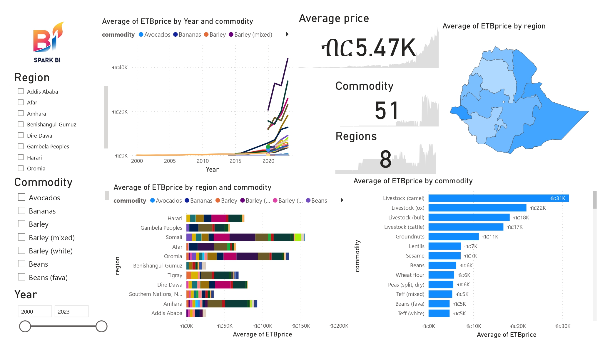

# 🇪🇹 Ethiopia Food Price Analysis Dashboard

This project presents an interactive Power BI dashboard exploring regional food price trends in Ethiopia. It provides key insights into the variation of food costs across regions and time using data sourced from the [World Food Programme](https://www.kaggle.com/datasets/usmanlovescode/ethiopia-food-prices-dataset).

## 📊 Key Features

- 📍 Regional average food price comparison  
- 📈 Annualy trend analysis of food item prices  
- 🥘 Top 10 most expensive food items  
- 🧭 Interactive filters for region, item, and date  
- 🧮 KPI cards for quick insights  

## 📁 Project Files

- `Ethiopia_Food_Prices.pbix` — The Power BI file with the full dashboard
- `/images` — Screenshots of the dashboard
- `/data` — Not included due to licensing; dataset linked below

## 🔗 Dataset Source

- [Kaggle: Ethiopia Food Prices Dataset](https://www.kaggle.com/datasets/usmanlovescode/ethiopia-food-prices-dataset)

## 🛠️ Tools & Technologies

- Power BI Desktop  
- Power Query  
- DAX  
- Git & GitHub for version control  

## 📌 How to Use

1. Clone the repository or download the `.pbix` file  
2. Open it with Power BI Desktop  
3. Explore the dashboard and apply filters to gain insights

## 📈 Sample Dashboard View

## 👤 Author

**Henock** 🇪🇹  
Aspiring Data Analyst | Power BI Enthusiast  
Feel free to connect with me on [LinkedIn](https://www.linkedin.com/in/henock-adane-06b24b109?lipi=urn%3Ali%3Apage%3Ad_flagship3_profile_view_base_contact_details%3BdewTOpL4TnaZiJgcVw23WQ%3D%3D) or reach out for collaboration.
<meetheni@gmail.com>

---

## 💡 Future Improvements
  
- Expand dataset with weather or transportation costs to explore correlations

